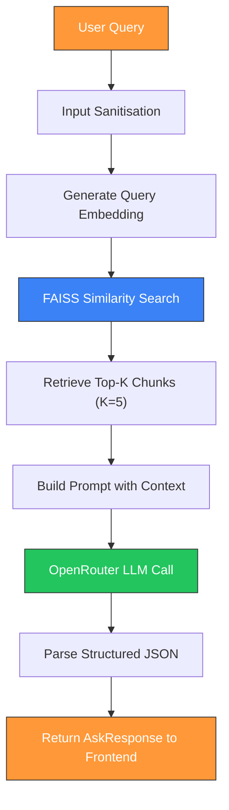
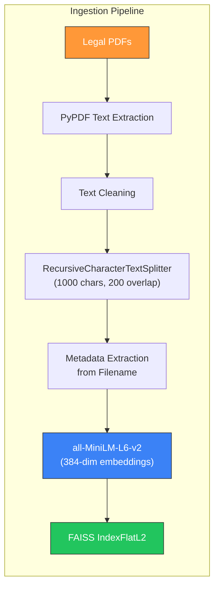
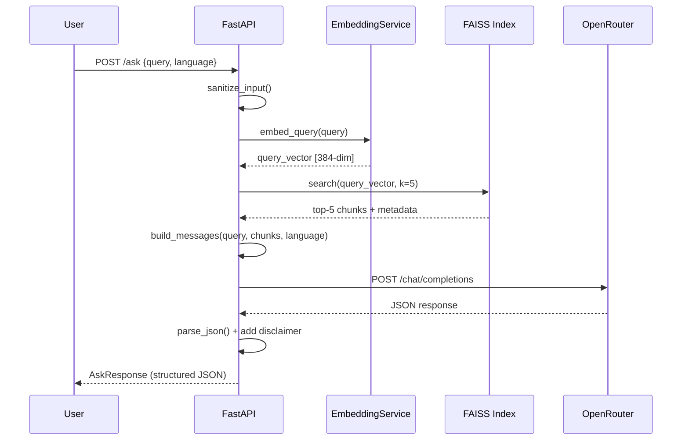
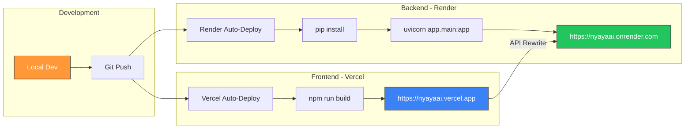

# NyayaAI – Architecture Documentation

## System Overview

NyayaAI is a **Retrieval-Augmented Generation (RAG)** system that combines:
1. **Document retrieval** from a FAISS vector index of Indian legal documents
2. **Language Model generation** via OpenRouter for structured, bilingual responses

This architecture ensures responses are **grounded in actual legal text** rather than hallucinated.

---

## RAG Flow



---

## Embedding Process



### Details:
- **Model:** `sentence-transformers/all-MiniLM-L6-v2` (384 dimensions, normalised)
- **Index:** FAISS `IndexFlatL2` – exact search, suitable for < 100K vectors
- **Chunking:** Recursive splitting on `\n\n`, `\n`, `. `, ` ` boundaries
- **Metadata per chunk:**
  ```json
  {
    "law": "IPC",
    "section": "Section 302",
    "source": "IPC__Section-302__Criminal.pdf",
    "category": "Criminal"
  }
  ```

---

## Retrieval Process

1. **Query embedding** – The user's question is encoded using the same MiniLM model.
2. **FAISS search** – L2 distance search returns the top-K most similar chunks.
3. **Score-based ranking** – Lower L2 distance = more relevant.
4. **Metadata preservation** – Each chunk carries its law, section, source, and category.



---

## LLM Interaction

### Provider: OpenRouter
- **Endpoint:** `https://openrouter.ai/api/v1/chat/completions`
- **Model:** `mistralai/mistral-7b-instruct` (free tier)
- **Temperature:** 0.2 (low for factual accuracy)
- **Max Tokens:** 1024

### Prompt Structure:
1. **System Prompt** – Defines NyayaAI persona, rules (bilingual, no jargon, must cite law, must disclaim), and required JSON output schema.
2. **User Prompt** – Contains: retrieved context chunks with metadata, user's question, and language instruction.

### Output Format:
```json
{
  "summary": "Plain-language explanation",
  "relevant_law": "Section X of Y Act, 20XX",
  "your_rights": "Rights in this situation",
  "next_steps": ["Step 1", "Step 2", "Step 3"],
  "disclaimer": "This is informational only..."
}
```

### Fallback Strategy:
If the LLM response cannot be parsed as JSON:
1. Try extracting JSON from markdown code fences
2. Try finding first `{...}` block
3. Fallback: use raw text as `summary` field

---

## Deployment Flow



### Environment Variables:

| Variable             | Where       | Description                      |
| -------------------- | ----------- | -------------------------------- |
| `OPENROUTER_API_KEY` | Render      | OpenRouter API key               |
| `MODEL_NAME`         | Render      | LLM model identifier             |
| `VITE_API_URL`       | Vercel      | Backend URL for API calls         |

---

## Security Architecture

```
User Input → Sanitise (regex) → Validate Length → Rate Limit (slowapi)
                                                         ↓
                                                   Process Query
                                                         ↓
                                              Return with Disclaimer
```

- **Prompt injection detection** – 10+ regex patterns for common injection attempts
- **Input cleaning** – null bytes, control chars, whitespace normalisation
- **Length validation** – 5–2000 character bounds
- **Rate limiting** – 10 req/min per IP via `slowapi`
- **CORS** – configurable allowed origins
- **No secrets in code** – all via `.env` / environment variables
